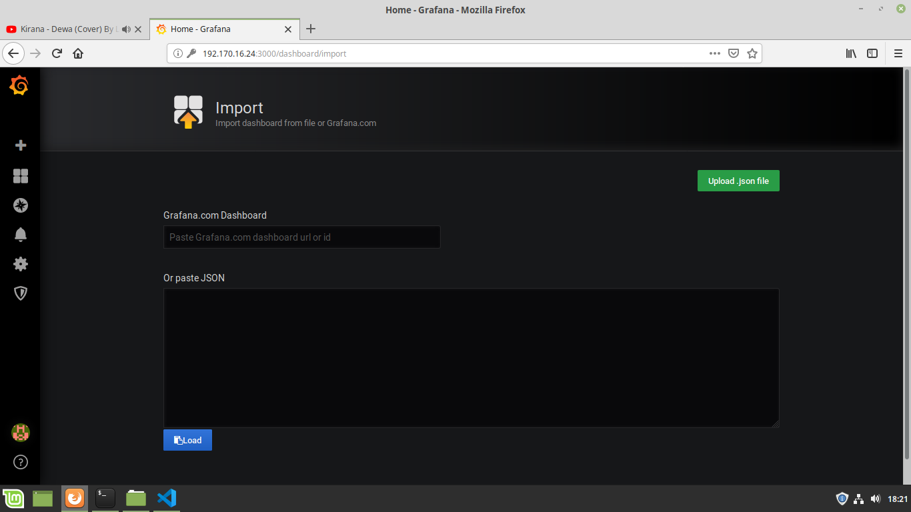
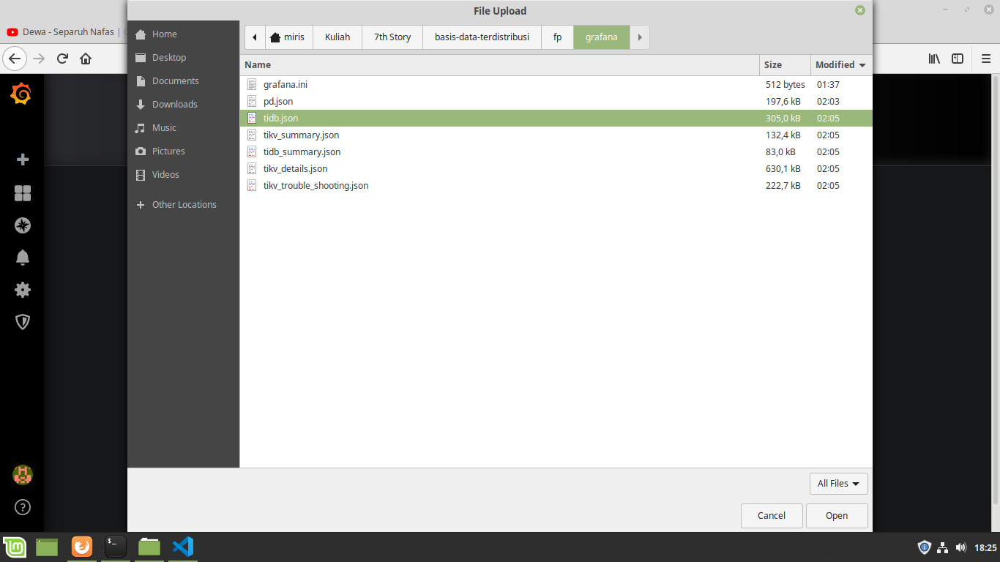
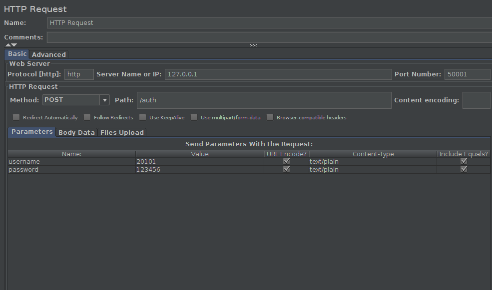
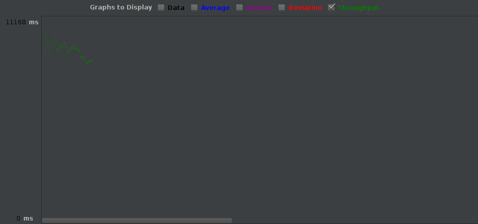
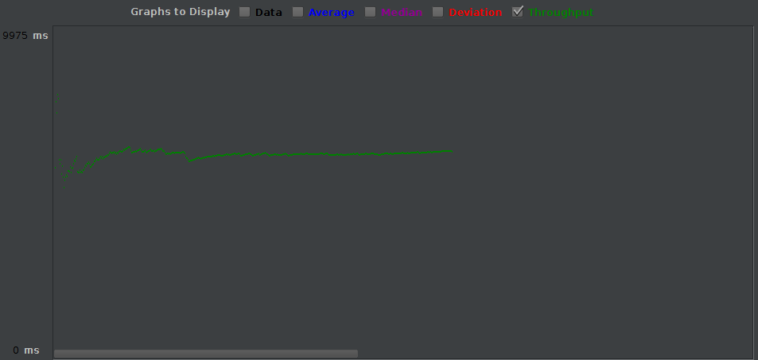
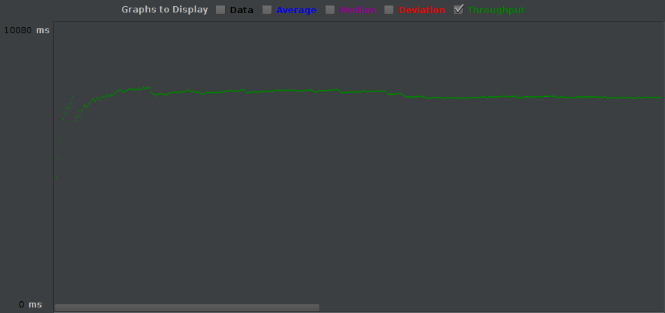
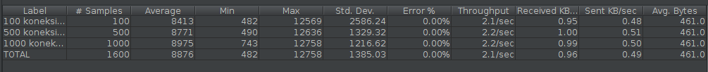
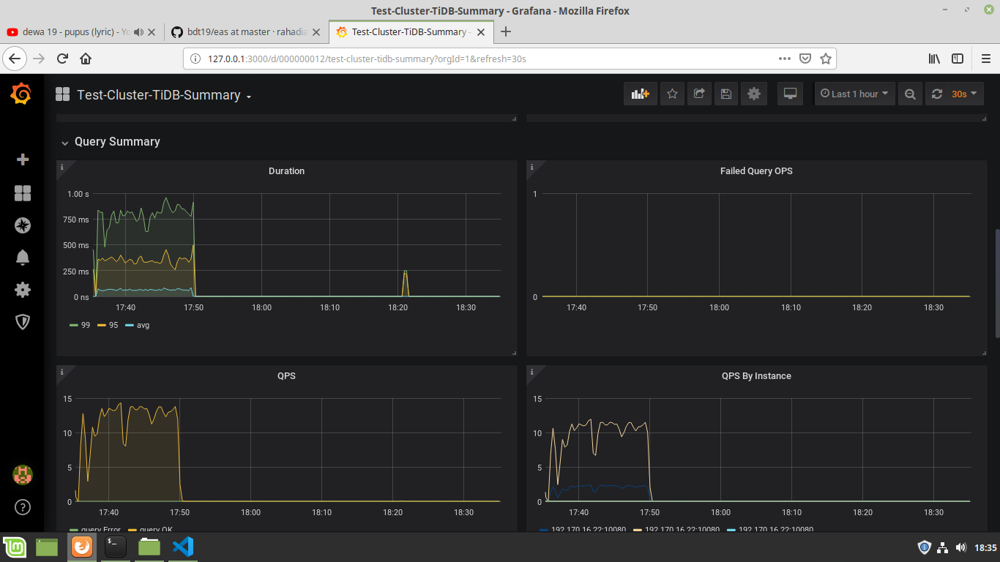
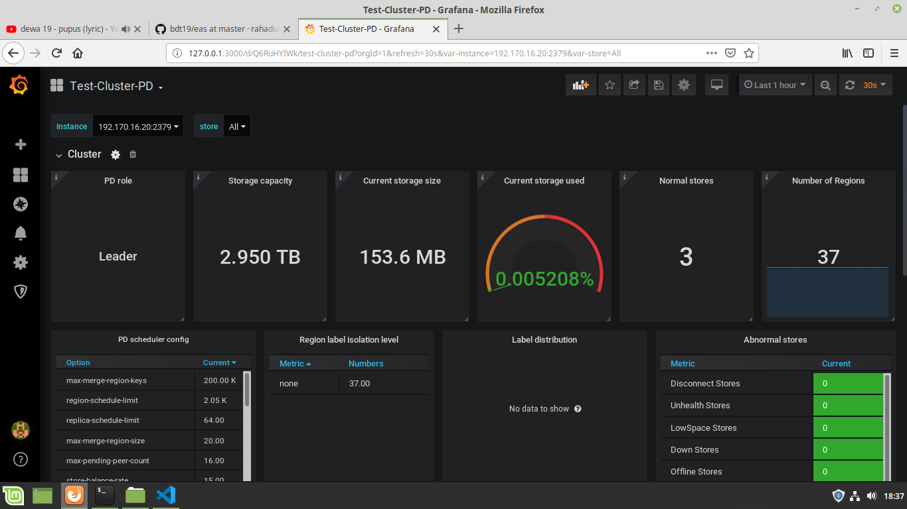

# Implementasi Redis Cluster untuk Caching pada Wordpress #
## Topology ##


## Development Environment ##
- Docker Host: Linux Mint 19.1 Teressa 4GB 64-bit
- Web App Host: Linux Mint 19.1 Teressa 8GB 64-bit

## Requirements ##
- Docker
- TiDB, TiKV, PD, Prometheus, dan Grafana Docker Image
- Node Exporter
- Apache JMeter (+ Java JDK)
- Sysbench

## Outline ##
- Instalasi requirement dan persiapan
- Menjalankan TiDB, TiKV, PD, Prometheus, dan Grafana Docker Instance serta Node Exporter
- Pengujian TiDB Cluster menggunakan Web App
- Uji Performa
  - Aplikasi
  - Basis Data
  - Fail Over
- Monitoring Dashboard

## Instalasi Requirement dan Persiapan ##
- Docker
 ```bash
sudo apt-get install docker-engine
 ```
- TiDB, TiKV, PD, Prometheus, dan Grafana Docker Image serta Node Exporter
 ```bash
sudo docker pull pingcap/tidb;
sudo docker pull pingcap/tikv;
sudo docker pull pingcap/pd;
sudo docker pull prom/prometheus;
sudo docker pull grafana/grafana;
sudo wget https://github.com/prometheus/node_exporter/releases/download/v0.18.1/node_exporter-0.18.1.linux-amd64.tar.gz
tar zxf node_exporter-0.18.1.linux-amd64.tar.gz -C ./prometheus/
 ```

- Java JDK
```bash
sudo apt install openjdk-8-jre-headless;
```

- Apache JMeter
```bash
sudo wget https://www-eu.apache.org/dist/jmeter/binaries/apache-jmeter-5.2.tgz;
tar zxf apache-jmeter-5.2.tgz -C /home/[user]/;
```

- Sysbench
```bash
curl -s https://packagecloud.io/install/repositories/akopytov/sysbench/script.deb.sh | sudo bash;
sudo apt install sysbench;
```

## Menjalankan TiDB, TiKV, PD, Prometheus, dan Grafana Docker Instance serta Node Exporter ##
- Membuat Docker Network
```bash
sudo docker network create --subnet=192.170.16.0/24 fpnet;
```

- Membuat PD Instance
```bash
sudo docker run -d \
    --name pd1 \
    --net fpnet \
    --ip 192.170.16.19 \
    pingcap/pd:latest \
    --name="pd1" \
    --client-urls="http://0.0.0.0:2379" \
    --advertise-client-urls="http://192.170.16.19:2379" \
    --peer-urls="http://0.0.0.0:2380" \
    --advertise-peer-urls="http://192.170.16.19:2380" \
    --initial-cluster="pd1=http://192.170.16.19:2380,pd2=http://192.170.16.20:2380,pd3=http://192.170.16.21:2380";

sudo docker run -d \
    --name pd2 \
    --net fpnet \
    --ip 192.170.16.20 \
    pingcap/pd:latest \
    --name="pd2" \
    --client-urls="http://0.0.0.0:2379" \
    --advertise-client-urls="http://192.170.16.20:2379" \
    --peer-urls="http://0.0.0.0:2380" \
    --advertise-peer-urls="http://192.170.16.20:2380" \
    --initial-cluster="pd1=http://192.170.16.19:2380,pd2=http://192.170.16.20:2380,pd3=http://192.170.16.21:2380";

sudo docker run -d \
    --name pd3 \
    --net fpnet \
    --ip 192.170.16.21 \
    pingcap/pd:latest \
    --name="pd3" \
    --client-urls="http://0.0.0.0:2379" \
    --advertise-client-urls="http://192.170.16.21:2379" \
    --peer-urls="http://0.0.0.0:2380" \
    --advertise-peer-urls="http://192.170.16.21:2380" \
    --initial-cluster="pd1=http://192.170.16.19:2380,pd2=http://192.170.16.20:2380,pd3=http://192.170.16.21:2380";
```

- Membuat TiKV Instance
```bash
sudo docker run -d \
    --name tikv1 \
    --net fpnet \
    --ip 192.170.16.16 \
    pingcap/tikv:latest \
    --addr="0.0.0.0:20160" \
    --advertise-addr="192.170.16.16:20160" \
    --pd="192.170.16.19:2379,192.170.16.20:2379,192.170.16.21:2379";

sudo docker run -d \
    --name tikv2 \
    --net fpnet \
    --ip 192.170.16.17 \
    pingcap/tikv:latest \
    --addr="0.0.0.0:20160" \
    --advertise-addr="192.170.16.17:20160" \
    --pd="192.170.16.19:2379,192.170.16.20:2379,192.170.16.21:2379";

sudo docker run -d \
    --name tikv3 \
    --net fpnet \
    --ip 192.170.16.18 \
    pingcap/tikv:latest \
    --addr="0.0.0.0:20160" \
    --advertise-addr="192.170.16.18:20160" \
    --pd="192.170.16.19:2379,192.170.16.20:2379,192.170.16.21:2379";
```

- Membuat TiDB Instance
```bash
sudo docker run -d \
    --name tidb \
    --net fpnet \
    --ip 192.170.16.22 \
    -p 4000:4000 \
    -p 10080:10080 \
    pingcap/tidb:latest \
    --store=tikv \
    --path="192.170.16.19:2379,192.170.16.20:2379,192.170.16.21:2379";
```

- Buat user untuk untuk basis data
```bash
mysql -u root -h 127.0.0.1 -P 4000 -e "create user if not exists 'dbuser'@'%' identified by 'dbpassword'; grant all privileges on elaporan.* to 'dbuser'@'%'; flush privileges;";
```

- Menambahkan dan menjalankan node_exporter ke docker instance yang akan dimonitor
```bash
sudo docker cp ./prometheus/node_exporter-0.18.1.linux-amd64/node_exporter pd1:/;
sudo docker cp ./prometheus/node_exporter-0.18.1.linux-amd64/node_exporter pd2:/;
sudo docker cp ./prometheus/node_exporter-0.18.1.linux-amd64/node_exporter pd3:/;
sudo docker cp ./prometheus/node_exporter-0.18.1.linux-amd64/node_exporter tikv1:/;
sudo docker cp ./prometheus/node_exporter-0.18.1.linux-amd64/node_exporter tikv2:/;
sudo docker cp ./prometheus/node_exporter-0.18.1.linux-amd64/node_exporter tikv3:/;

sudo docker exec -d -it pd1 ./node_exporter;
sudo docker exec -d -it pd2 ./node_exporter;
sudo docker exec -d -it pd3 ./node_exporter;
sudo docker exec -d -it tikv1 ./node_exporter;
sudo docker exec -d -it tikv2 ./node_exporter;
sudo docker exec -d -it tikv3 ./node_exporter;
```

- Membuat Prometheus Instance
```bash
sudo docker run -d \
    --name prom \
    --net fpnet \
    --ip 192.170.16.23 \
    -p 9090:9090 \
    -v "/home/miris/Kuliah/7th Story/basis-data-terdistribusi/fp/prometheus/prometheus.yml:/etc/prometheus/prometheus.yml" \
    prom/prometheus \
    --config.file=/etc/prometheus/prometheus.yml;
```
File [prometheus.yml](prometheus/prometheus.yml) digunakan sebagai config file dari prometheus.

- Membuat Grafana Instance
```bash
wget https://raw.githubusercontent.com/pingcap/tidb-ansible/master/scripts/pd.json -P ./grafana/;
wget https://raw.githubusercontent.com/pingcap/tidb-ansible/master/scripts/tidb.json -P ./grafana/;
wget https://raw.githubusercontent.com/pingcap/tidb-ansible/master/scripts/tidb_summary.json -P ./grafana/;
wget https://raw.githubusercontent.com/pingcap/tidb-ansible/master/scripts/tikv_summary.json -P ./grafana/;
wget https://raw.githubusercontent.com/pingcap/tidb-ansible/master/scripts/tikv_details.json -P ./grafana/;
wget https://raw.githubusercontent.com/pingcap/tidb-ansible/master/scripts/tikv_trouble_shooting.json -P ./grafana/;

sudo docker run -d \
    --name grafana \
    --net fpnet \
    --ip 192.170.16.24 \
    -p 3000:3000 \
    -v "/home/miris/Kuliah/7th Story/basis-data-terdistribusi/fp/grafana/grafana.ini:/conf/grafana.ini" \
    grafana/grafana \
    --config="/conf/grafana.ini";
```
[grafana.ini](grafana/grafana.ini) adalah file konfigurasi untuk node grafana. 6 file json yang diunduh digunakan untuk menampilkan hasil monitoring pada TiDB, TiKV, dan Placement Driver dari Prometheus ke Grafana.
 \
\


## Uji Kinerja
### Uji Kinerja Aplikasi dengan JMeter
Uji kinerja aplikasi dilakukan pada proses login dengan HTTP Request sebagai berikut.

- Uji Kinerja Aplikasi dengan 100 koneksi (thread: 20, loop: 5)

- Uji Kinerja Aplikasi dengan 500 koneksi (thread: 20, loop: 25)

- Uji Kinerja Aplikasi dengan 1000 koneksi (thread: 20, loop: 50)

- Tabel:


### Uji Kinerja Basis Data dengan Sysbench
- Uji Kinerja dengan 3 PD
```text
SQL statistics:
    queries performed:
        read:                            54233
        write:                           0
        other:                           0
        total:                           54233
    transactions:                        54233  (5421.51 per sec.)
    queries:                             54233  (5421.51 per sec.)
    ignored errors:                      0      (0.00 per sec.)
    reconnects:                          0      (0.00 per sec.)

General statistics:
    total time:                          10.0017s
    total number of events:              54233

Latency (ms):
         min:                                  0.38
         avg:                                  0.73
         max:                                 19.24
         95th percentile:                      1.14
         sum:                              39752.06

Threads fairness:
    events (avg/stddev):           13558.2500/24.51
    execution time (avg/stddev):   9.9380/0.00
```

- Uji Kinerja dengan 2 PD
```text
SQL statistics:
    queries performed:
        read:                            50921
        write:                           0
        other:                           0
        total:                           50921
    transactions:                        50921  (5089.73 per sec.)
    queries:                             50921  (5089.73 per sec.)
    ignored errors:                      0      (0.00 per sec.)
    reconnects:                          0      (0.00 per sec.)

General statistics:
    total time:                          10.0031s
    total number of events:              50921

Latency (ms):
         min:                                  0.38
         avg:                                  0.78
         max:                                 23.67
         95th percentile:                      1.32
         sum:                              39767.32

Threads fairness:
    events (avg/stddev):           12730.2500/26.98
    execution time (avg/stddev):   9.9418/0.00
```

- Uji Kinerja dengan 1 PD
```text
SQL statistics:
    queries performed:
        read:                            59653
        write:                           0
        other:                           0
        total:                           59653
    transactions:                        59653  (5963.42 per sec.)
    queries:                             59653  (5963.42 per sec.)
    ignored errors:                      0      (0.00 per sec.)
    reconnects:                          0      (0.00 per sec.)

General statistics:
    total time:                          10.0016s
    total number of events:              59653

Latency (ms):
         min:                                  0.37
         avg:                                  0.67
         max:                                 24.42
         95th percentile:                      0.95
         sum:                              39735.74

Threads fairness:
    events (avg/stddev):           14913.2500/62.27
    execution time (avg/stddev):   9.9339/0.00
```

## Monitoring Dashboard ##
- TiDB Monitor

- PD Monitor

- TiKV Monitor
