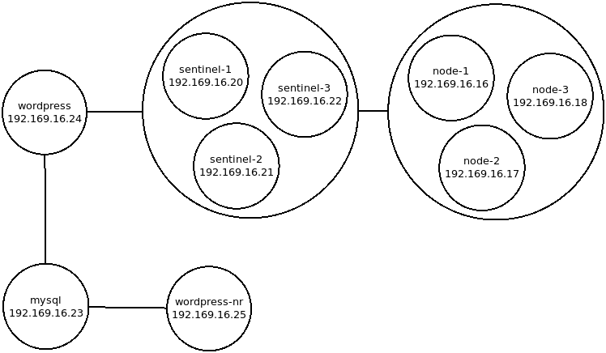
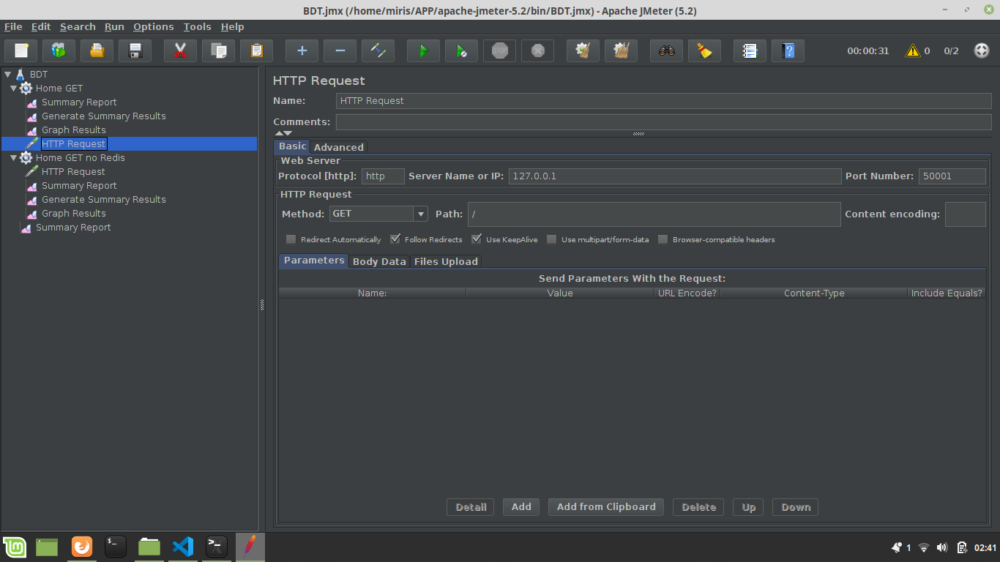
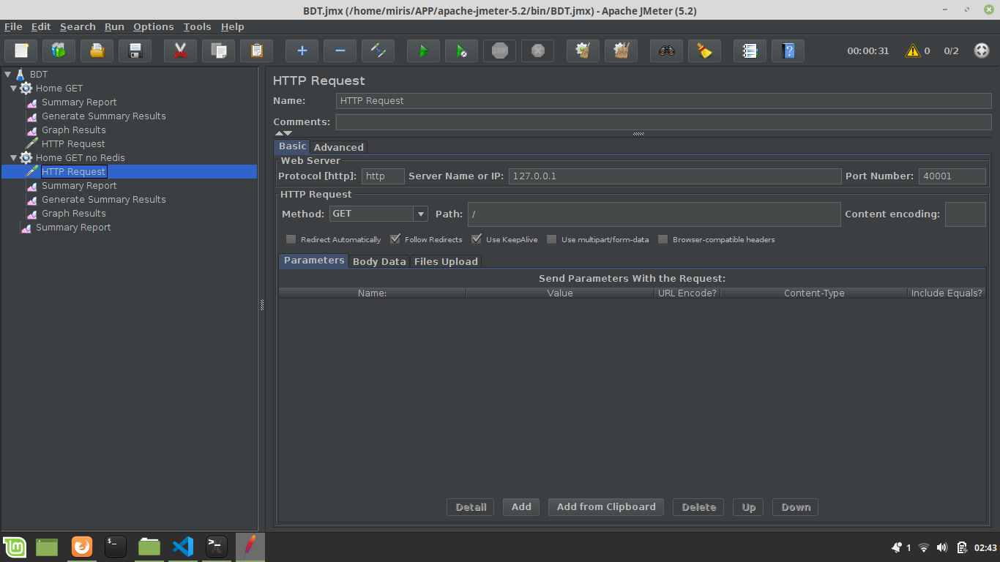
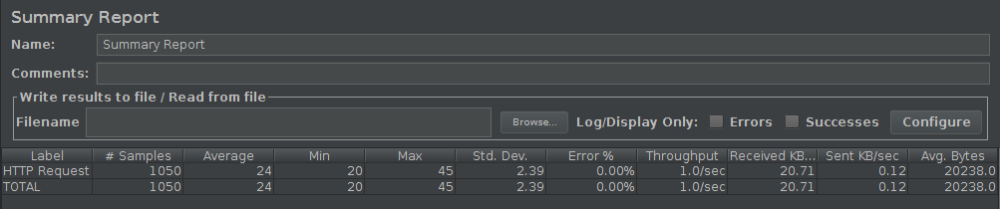
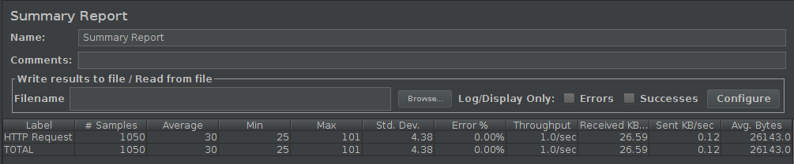

# Implementasi Redis Cluster untuk Caching pada Wordpress #
## Topology ##

- **Keterangan: wordpress-nr adalah docker instance wordpress yang tidak menggunakan Redis Object Cache**

## Development Environment ##
Linux Mint 19.1 Teressa 8GB 64-bit

## Requirements ##
- Docker
- Redis, Redis Sentinel, MySQL, dan Wordpress Docker Image
- Apache JMeter

## Outline ##
- Instalasi requirement dan persiapan
- Menjalankan Redis, Redis Sentinel, MySQL, dan Wordpress Docker Instance
- Pengujian Wordpress dengan Redis Object Cache dan Wordpress tanpa Redis Object Cache

## Instalasi Requirement dan Persiapan ##
- Docker
 ```bash
sudo apt-get install docker-engine
 ```
- Redis, Redis Sentinel, MySQL, dan Wordpress Docker Image
 ```bash
sudo docker pull bitnami/redis;
sudo docker pull bitnami/redis-sentinel;
sudo docker pull mysql:5.7;
sudo docker pull wordpress:5.3.0-apache;
 ```

- Java JDK
```bash
sudo apt install openjdk-8-jre-headless;
```

- Apache JMeter
```bash
sudo wget https://www-eu.apache.org/dist/jmeter/binaries/apache-jmeter-5.2.tgz;
tar zxf apache-jmeter-5.2.tgz -C /home/[user]/
```

## Menjalankan Redis, Redis Sentinel, MySQL, dan Wordpress Docker Instance ##
- Membuat Docker Network
```bash
sudo docker network create --subnet=192.169.16.0/24 redis;
```

- Membuat Redis instance
```bash
sudo docker run -d \
    --net redis \
    --ip 192.169.16.16 \
    -p 6379:6379 \
    --name node-1 \
    --hostname node-1 \
    -e REDIS_REPLICATION_MODE=master \
    -e ALLOW_EMPTY_PASSWORD=yes \
    bitnami/redis;

sudo docker run -d \
    --net redis \
    --ip 192.169.16.17 \
    -p 6380:6379 \
    --name node-2 \
    --hostname node-2 \
    -e REDIS_REPLICATION_MODE=slave \
    -e REDIS_MASTER_HOST=192.169.16.16 \
    -e REDIS_MASTER_PORT_NUMBER=6379 \
    -e ALLOW_EMPTY_PASSWORD=yes \
    bitnami/redis;

sudo docker run -d \
    --net redis \
    --ip 192.169.16.18 \
    -p 6381:6379 \
    --name node-3 \
    --hostname node-3 \
    -e REDIS_REPLICATION_MODE=slave \
    -e REDIS_MASTER_HOST=192.169.16.16 \
    -e REDIS_MASTER_PORT_NUMBER=6379 \
    -e ALLOW_EMPTY_PASSWORD=yes \
    bitnami/redis;
```

- Membuat Redis-Sentinel instance
```bash
sudo docker run -d \
    --net redis \
    --ip 192.169.16.20 \
    -p 26379:26379 \
    --name sentinel-1 \
    --hostname sentinel-1 \
    -e REDIS_MASTER_HOST=192.169.16.16 \
    -e REDIS_MASTER_PORT_NUMBER=6379 \
    -e REDIS_SENTINEL_QUORUM=2 \
    bitnami/redis-sentinel;

sudo docker run -d \
    --net redis \
    --ip 192.169.16.21 \
    -p 26380:26379 \
    --name sentinel-2 \
    --hostname sentinel-2 \
    -e REDIS_MASTER_HOST=192.169.16.16 \
    -e REDIS_MASTER_PORT_NUMBER=6379 \
    -e REDIS_SENTINEL_QUORUM=2 \
    bitnami/redis-sentinel;

sudo docker run -d \
    --net redis \
    --ip 192.169.16.22 \
    -p 26381:26379 \
    --name sentinel-3 \
    --hostname sentinel-3 \
    -e REDIS_MASTER_HOST=192.169.16.16 \
    -e REDIS_MASTER_PORT_NUMBER=6379 \
    -e REDIS_SENTINEL_QUORUM=2 \
    bitnami/redis-sentinel;
```

- Membuat MySQL instance beserta database yang dibutuhkan (dependensi dari Wordpress)
```bash
sudo docker run -d \
    --net redis \
    --ip 192.169.16.23 \
    -p 33060:3306 \
    --name mysql \
    --hostname mysql \
    -e MYSQL_ROOT_PASSWORD=root \
    -e MYSQL_USER=dbuser \
    -e MYSQL_PASSWORD=dbpassword \
    -e MYSQL_DATABASE=redistest \
    mysql:5.7;

sleep 30;

sudo docker exec -it mysql echo "create database noredis;" | mysql -u root -proot;
```

- Membuat Wordpress instance yang menggunakan redis caching
```bash
sudo docker run -d \
    --net redis \
    --ip 192.169.16.24 \
    -p 50001:80 \
    --name wordpress \
    --hostname wordpress \
    -e WORDPRESS_DB_HOST=192.169.16.23 \
    -e WORDPRESS_DB_USER=dbuser \
    -e WORDPRESS_DB_PASSWORD=dbpassword \
    -e WORDPRESS_DB_NAME=redistest \
    -e WORDPRESS_CONFIG_EXTRA='define("WP_REDIS_CLIENT", "predis");
                               define("WP_REDIS_SENTINEL", "mymaster");
                               define("WP_REDIS_SERVERS",
                                          ["tcp://192.169.16.20:26379?alias=sentinel-1",
                                           "tcp://192.169.16.21:26379?alias=sentinel-2",
                                           "tcp://192.169.16.22:26379?alias=sentinel-3"]); \
                               define("WP_CACHE", true);' \
    wordpress:5.3.0-apache;
```
Wordpress dapat diakses dengan membuka link http://127.0.0.1:50001 dan download plugin Redis Object Cache dari halaman admin Wordpress.
**Keterangan: jalankan perintah ```sudo docker exec -it wordpress sed -i "s/return 'INFO'/return 'info'/g" /var/www/html/wp-content/plugins/redis-cache/includes/predis/src/Command/ServerInfo.php;``` untuk mengatasi bug dari plugin redis cache**

- Membuat Wordpress instance yang tidak menggunakan redis caching.
```bash
sudo docker run -d \
    --net redis \
    --ip 192.169.16.25 \
    -p 40001:80 \
    --name wordpress-nr \
    --hostname wordpress \
    -e WORDPRESS_DB_HOST=192.169.16.23 \
    -e WORDPRESS_DB_USER=root \
    -e WORDPRESS_DB_PASSWORD=root \
    -e WORDPRESS_DB_NAME=noredis \
    wordpress:5.3.0-apache;
```
Wordpress dapat diakses dengan membuka link http://127.0.0.1:40001.

## Pengujian Wordpress dengan Redis Object Cache dan Wordpress tanpa Redis Object Cache ##
- Menjalankan Apache JMeter
```bash
cd /home/[user]/apache-jmeter-5.2/bin;
java -jar ApacheJMeter.jar
```

- Pengaturan Uji Coba JMeter untuk Wordpress dengan Redis Object Cache


- Pengaturan Uji Coba JMeter untuk Wordpress tanpa Redis Object Cache


- Hasil Uji Coba JMeter untuk Wordpress dengan Redis Object Cache


- Hasil Uji Coba JMeter untuk Wordpress tanpa Redis Object Cache

