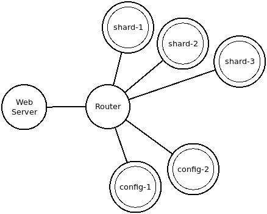
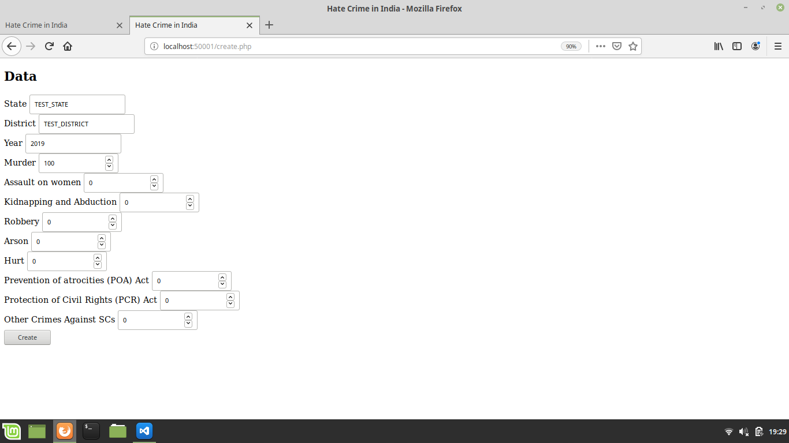
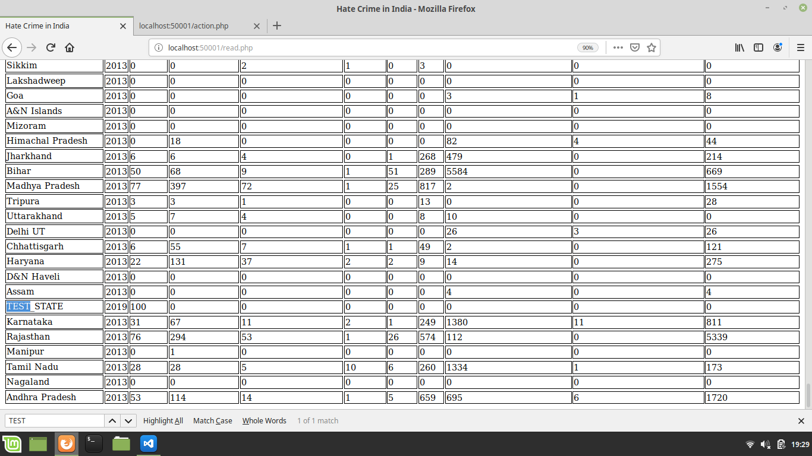
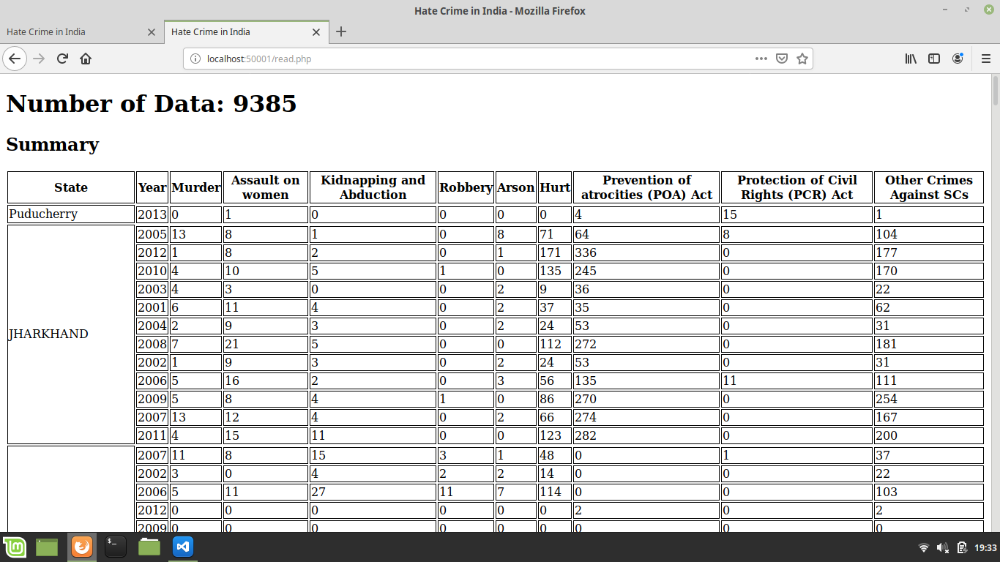
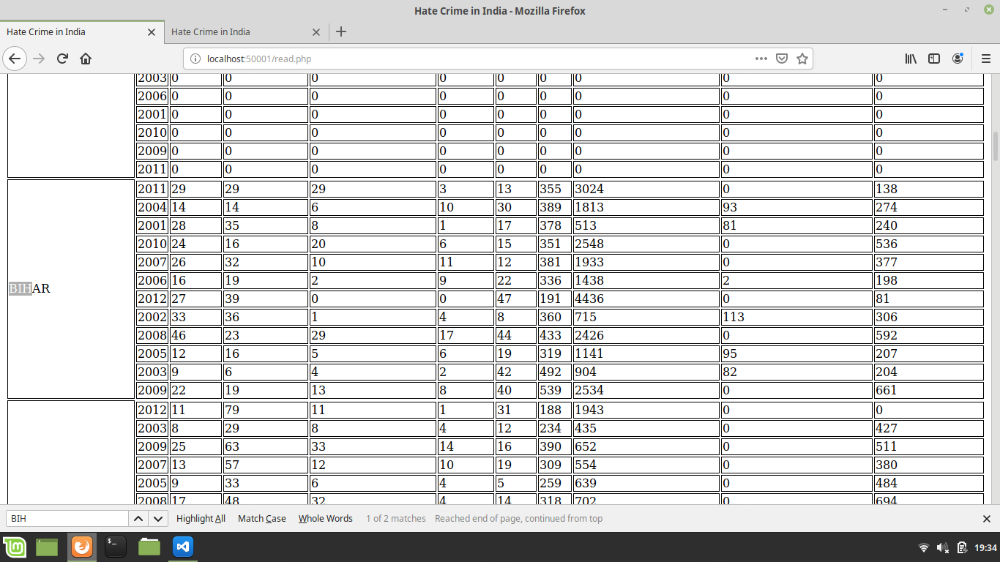
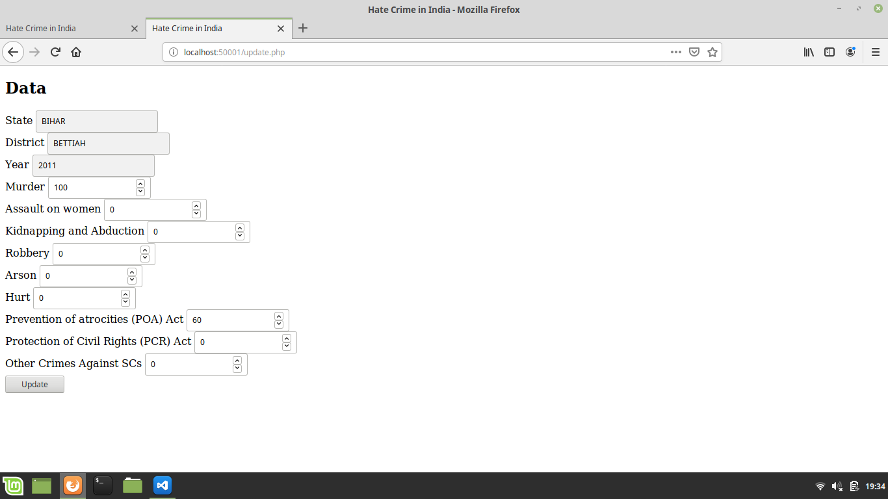
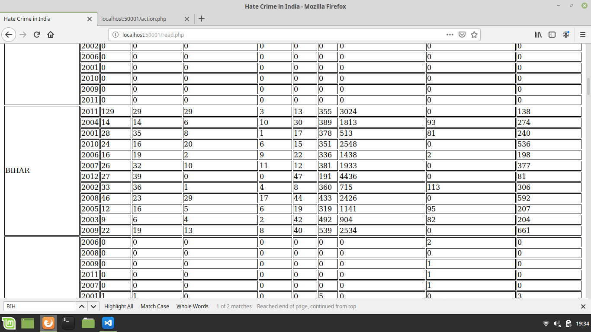
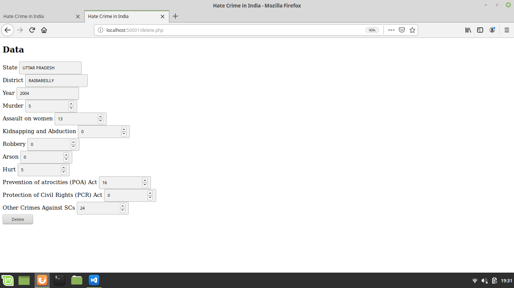
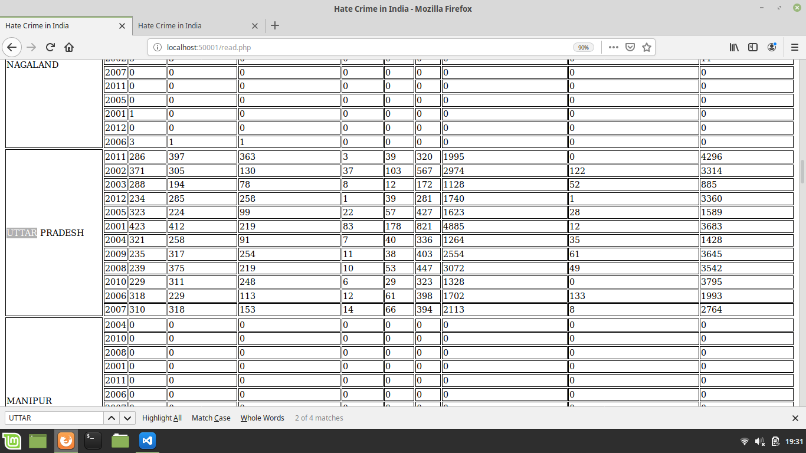
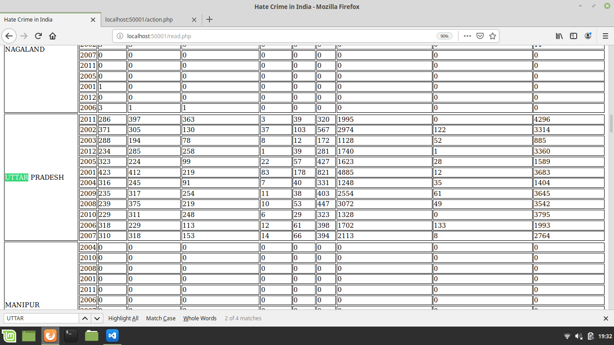

# Implementasi MongoDB Sharding #
## Topology ##


## Development Environment ##
Linux Mint 19.1 Teressa 8GB 64-bit

## Requirements ##
- Docker
- MongoDB Docker Image
- PHP 7.4-dev
- MongoDB PHP Extension versi 1.6+

## Outline ##
- Instalasi requirement dan persiapan
- Menjalankan MongoDB Docker

## Instalasi Requirement dan Persiapan ##
- Docker
 ```bash
sudo apt-get install docker-engine
 ```
- MongoDB Docker Image
 ```bash
sudo docker pull mongo:4.2
 ```
- PHP 7.4-dev
 ```bash
sudo apt-get install php7.4-dev
 ```
 - MongoDB PHP Extension versi 1.6+
 ```bash
wget https://pecl.php.net/get/mongodb-1.6.0.tgz
tar zxf mongodb-1.6.0.tgz -C /tmp
cd /tmp/mongodb-1.6.0
phpize7.4
./configure
sudo make all
sudo make install
 ```
- Menambahkan driver php-mongodb di direktori project (dalam hal ini direktori webshard)
```bash
cd /path/to/project/webshard
composer require mongodb/mongodb
```
## Menjalankan MongoDB Docker ##
- Membuat Docker Network
```bash
sudo docker network create --subnet=192.168.0.0/22 mdbnet
```
- Menjalankan MongoDB Docker Instance sebagai Config Server
```bash
sudo docker run -d --rm --net mdbnet --ip 192.168.1.1 -p 37019:27019 --name config-1 --hostname config-1 mongo:4.2 --replSet config-conf --configsvr;

sudo docker run -d --rm --net mdbnet --ip 192.168.1.2 -p 37029:27019 --name config-2 --hostname config-2 mongo:4.2 --replSet config-conf --configsvr;
```
**Keterangan:**
- port 27019 adalah default port untuk config server MongoDB
- hapus parameter ```--rm``` jika tidak ingin menghapus MongoDB instance setelah instance dihentikan.

- Melakukan inisiasi Replica Set untuk config server (Jalankan hanya pada satu config server yang akan digunakan sebagai master)
```bash
sudo docker exec -d -it config-1 mongo -port 27019 --eval 'rs.initiate({ _id: "config-conf", members: [{ _id: 0, host: "192.168.1.1:27019" }, { _id: 1, host: "192.168.1.2:27019" }]});';
```

- Menjalankan MongoDB Docker Instance sebagai Shard Server
```bash
sudo docker run -d --rm --net mdbnet --ip 192.168.2.1 -p 47018:27018 --name shard-1 --hostname shard-1 mongo:4.2 --replSet shard-1-rs --shardsvr;

sudo docker run -d --rm --net mdbnet --ip 192.168.2.2 -p 47028:27018 --name shard-2 --hostname shard-2 mongo:4.2 --replSet shard-2-rs --shardsvr;

sudo docker run -d --rm --net mdbnet --ip 192.168.2.3 -p 47038:27018 --name shard-3 --hostname shard-3 mongo:4.2 --replSet shard-3-rs --shardsvr;
```
**Keterangan:**
- port 27018 adalah default port untuk shard server MongoDB
- hapus parameter ```--rm``` jika tidak ingin menghapus MongoDB instance setelah instance dihentikan.

- Melakukan inisiasi Replica Set untuk masing-masing shard server.
```bash
sudo docker exec -d -it shard-1 mongo -port 27018 --eval 'rs.initiate({ _id: "shard-1-rs", members: [{ _id: 0, host: "192.168.2.1:27018" }]})';

sudo docker exec -d -it shard-2 mongo -port 27018 --eval 'rs.initiate({ _id: "shard-2-rs", members: [{ _id: 1, host: "192.168.2.2:27018" }]})';

sudo docker exec -d -it shard-3 mongo -port 27018 --eval 'rs.initiate({ _id: "shard-3-rs", members: [{ _id: 2, host: "192.168.2.3:27018" }]})';
```

- Menjalankan MongoDB Docker Instance sebagai Router
```bash
sudo docker run -d --rm --net mdbnet --ip 192.168.0.2 -p 27017:27017 --name router --hostname router mongo:4.2 mongos --configdb config-conf/192.168.1.1:27019,192.168.1.2:27019 --bind_ip_all;
```
**Keterangan:**
- hapus parameter ```--rm``` jika tidak ingin menghapus MongoDB instance setelah instance dihentikan.

- Expose shard server ke router
```bash
sudo docker exec -d -it router mongo --eval 'sh.addShard("shard-1-rs/192.168.2.1:27018"); sh.addShard("shard-2-rs/192.168.2.2:27018"); sh.addShard("shard-3-rs/192.168.2.3:27018");';
```

- Membuat database
```bash
sudo docker exec -d -it router mongo --eval 'use hate_crime_india;';
```

- Aktifkan sharding pada database dan collection beserta shard key.
```bash
sudo docker exec -d -it router mongo --eval 'sh.enableSharding("hate_crime_india"); db.createCollection("crime_by_district"); sh.shardCollection("hate_crime_india.crime_by_district", {"STATE": "hashed"});';
```

- Jalankan [data_parser.py](https://github.com/shunpeicloser/basis-data-terdistribusi/blob/master/sharding/data_parser.py) untuk memasukkan [dataset](https://github.com/shunpeicloser/basis-data-terdistribusi/blob/master/sharding/crime_by_district.csv) ke database yang telah dibuat.
```bash
python3 data_parser.py
```

- Jalankan webserver pada direktori webshard
```bash
php -S localhost:50001
```

- Aplikasi web dapat diakses melalui peramban dengan alamat http://localhost:50001.

## Contoh Pengaplikasian CRUD pada Webshard ##
- Create
    - memasukkan data
    
    - data berhasil dimasukkan
    
```php
$res = $collection->insertOne(
            $data
        );
```

- Read (sekaligus agregasi sum)
    - proses membaca seluruh data dan menampilkan jumlahan kasus untuk tiap tahun tiap district tiap state serta jumlah seluruh data yang ada.
    
```php
// count aggregation
$numOfData = $collection->aggregate([
        [
            '$count' => 'num'
        ]
    ])->toArray()[0]['num'];

// sum aggregation
array_push($summary, $collection->aggregate([
        [
            '$group' => [
                '_id'   => ['state' => '$STATE', 'year' => '$Year'],
                'Murder' => ['$sum' => '$Murder'],
                'Assault on women' => ['$sum' => '$Assault on women'],
                'Kidnapping and Abduction' => ['$sum' => '$Kidnapping and Abduction'],
                'Robbery' => ['$sum' => '$Robbery'],
                'Arson' => ['$sum' => '$Arson'],
                'Hurt' => ['$sum' => '$Hurt'],
                'Prevention of atrocities (POA) Act' => ['$sum' => '$Prevention of atrocities (POA) Act'],
                'Protection of Civil Rights (PCR) Act' => ['$sum' => '$Protection of Civil Rights (PCR) Act'],
                'Other Crimes Against SCs' => ['$sum' => '$Other Crimes Against SCs']
            ]
        ]
    ])->toArray() );
```

- Update
    - data yang akan di-update (BIHAR - BETTIAH - 2011)
    
    - data sebelum di-update
    
    - data yang di-update (Murder: 0 > 100)
    
    - data yang telah ter-update
    
```php
$res = $collection->updateOne(
            ['STATE' => $data['STATE'], 'DISTRICT' => $data['DISTRICT'], 'Year' => $data['Year']],
            ['$set' => $data]
        );
```

- Delete
    - data yang akan dihapus (UTTAR PRADESH - RAIBAREILLY - 2004)
    
    - data sebelum dihapus
    
    - data sesudah dihapus
    
```php
$res = $collection->deleteOne(
            ['STATE' => $data['STATE'], 'DISTRICT' => $data['DISTRICT'], 'Year' => $data['Year']]
        );
```
